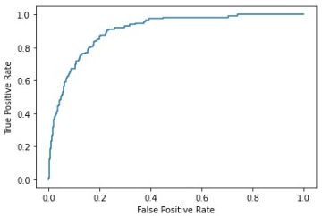
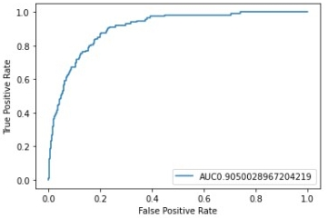

### EX NO : 07
### DATE  : 09.05.2022
# <p align="center"> ROC CURVE PLOT </p>
## Aim:
   To write python code to plot ROC curve used in ANN.
## Equipments Required:
1. Hardware – PCs
2. Anaconda – Python 3.7 Installation / Moodle-Code Runner /Google Colab

## Related Theory Concept:
The receiver operating characteristic (ROC) curve is frequently used for evaluating the performance of binary classification algorithms. It provides a graphical representation of a classifier’s performance, rather than a single value like most other metrics. First, let’s establish that in binary classification, there are four possible outcomes for a test prediction: true positive, false positive, true negative, and false negative. The ROC curve is produced by calculating and plotting the true positive rate against the false positive rate for a single classifier at a variety of thresholds.
## Uses of ROC Curve :
One advantage presented by ROC curves is that they aid us in finding a classification threshold that suits our specific problem.
On the other hand, if our classifier is predicting whether someone has a terminal illness, we might be ok with a higher number of false positives (incorrectly diagnosing the illness), just to make sure that we don’t miss any true positives (people who actually have the illness).

## Algorithm:
1. Import Necessary Packages.
2. Load the Data.
3. Create Training and Test Samples. 
4. Fit the Logistic Regression Model.
5. Diagnostics

## Program:
```
Program to plot Receiver Operating Characteristic [ROC] Curve.
Developed by   : R.SOMEASVAR
RegisterNumber :  21222123103
```
```
import pandas as pd
import numpy as np
from sklearn.model_selection import train_test_split
from sklearn.linear_model import LogisticRegression
from sklearn import metrics
import matplotlib.pyplot as plt
url="https://raw.githubusercontent.com/Statology/Python-Guides/main/default.csv"
data=pd.read_csv(url)
x=data[['student','balance','income']]
y=data['default']
X_train,X_test,Y_train,Y_test=train_test_split(x,y,test_size=0.3,random_state=0)
log=LogisticRegression()
log.fit(X_train,Y_train)
y_pred_proba=log.predict_proba(X_test)[::,1]
fpr,lpr,_=metrics.roc_curve(Y_test,y_pred_proba)
plt.plot(fpr,lpr)
plt.ylabel("True Positive Rate")
plt.ylabel("False Positive Rate")
plt.show()
y_pred_proba=log.predict_proba(X_test)[::,1]
fpr,lpr,_=metrics.roc_curve(Y_test,y_pred_proba)
auc=metrics.roc_auc_score(Y_test,y_pred_proba)
plt.plot(fpr,lpr,label="AUC=")
plt.ylabel("True Positive Rate")
plt.ylabel("False Positive Rate")
plt.show()
```
<br></br>
<br></br>
<br></br>
<br></br>
<br></br>
<br></br>
## Output:



## Result:
Thus the python program successully plotted Receiver Operating Characteristic [ROC] Curve.
